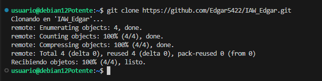

# EJERCICIO 14:
# Guía para crear, gestionar y sincronizar un repositorio de Git entre Windows y Linux

A continuación se documentan detalladamente los pasos a seguir para la creación de un repositorio en Git, tanto en local (Windows) como en remoto (GitHub), y su sincronización con una máquina virtual Linux (Debian).

## 1. Crear un repositorio local en Windows

### 1.1. Crear una carpeta para el repositorio local
   - En el Explorador de Archivos de Windows, crea una nueva carpeta en el directorio que prefieras. Por ejemplo:
     ```bash
     C:\Usuarios\Tu_Nombre\Documentos\prueba2_tu_nombre
     ```

### 1.2. Iniciar el repositorio Git
   - Abre la terminal de Git Bash o CMD en Windows.
   - Navega hasta la carpeta creada:
     ```bash
     cd C:\Usuarios\Tu_Nombre\Documentos\prueba2_tu_nombre
     ```
   - Inicializa un repositorio Git:
     ```bash
     git init
     ```

## 2. Crear los archivos necesarios en el repositorio

### 2.1. Crear los archivos de texto
   - Utiliza cualquier editor de texto (por ejemplo, Notepad) para crear los archivos `archivo1.txt` y `archivo2.txt` en la carpeta del repositorio. El contenido puede ser libre, por ejemplo:

   **Contenido de `archivo1.txt`:**

### 2.2. Agregar los archivos al índice de Git
- En la terminal de Git, agrega los archivos al área de preparación (staging):
  ```bash
  git add archivo1.txt archivo2.txt
  ```

### 2.3. Confirmar los cambios en el repositorio local
- Realiza un commit para confirmar los archivos añadidos:
  ```bash
  git commit -m "Agregar archivo1.txt y archivo2.txt"
  ```

## 3. Crear un repositorio remoto en GitHub

### 3.1. Crear un nuevo repositorio en GitHub
- Abre GitHub en tu navegador.
- Crea un nuevo repositorio en tu cuenta con el nombre `prueba2_tu_nombre` (sin inicializar con README ni otros archivos).

### 3.2. Conectar el repositorio local con el remoto
- En la terminal de Git, agrega la URL del repositorio remoto:
  ```bash
  git remote add origin https://github.com/TuUsuario/prueba2_tu_nombre.git
  ```

## 4. Subir el repositorio local a GitHub

### 4.1. Realizar el push al repositorio remoto
- Sube los cambios locales a GitHub con el siguiente comando:
  ```bash
  git push -u origin master
  ```

## 5. Clonar el repositorio en Linux (Debian)

### 5.1. Abrir la máquina virtual Debian y clonar el repositorio
- Inicia sesión en tu máquina virtual Linux Debian.
- Abre una terminal y ejecuta:
  ```bash
  git clone https://github.com/TuUsuario/prueba2_tu_nombre.git
  ```
Esto creará una copia del repositorio en la máquina virtual.

## 6. Modificar el repositorio en Windows

### 6.1. Modificar uno de los archivos existentes
- En Windows, abre `archivo1.txt` y realiza una modificación. Por ejemplo, agrega una línea al final:
  ```
  Este archivo ha sido modificado.
  ```

### 6.2. Crear un nuevo archivo de texto
- Crea un nuevo archivo llamado `archivo3.txt` y añade contenido. Por ejemplo:
  ```
  Este es el archivo 3 recién creado.
  ```

### 6.3. Confirmar y subir los cambios a GitHub
- Agrega los nuevos cambios al área de preparación:
  ```bash
  git add archivo1.txt archivo3.txt
  ```
- Realiza un commit para confirmar los cambios:
  ```bash
  git commit -m "Modificar archivo1.txt y agregar archivo3.txt"
  ```
  
- Sube los cambios al repositorio remoto:
  ```bash
  git push
  ```
  

## 7. Actualizar el repositorio en Debian

### 7.1. Obtener los últimos cambios en Debian
- En la máquina virtual Debian, abre la terminal y navega hasta el repositorio clonado:
  ```bash
  cd prueba2_tu_nombre
  ```
  
- Actualiza el repositorio con los últimos cambios del remoto:
  ```bash
  git pull
  ```
  

